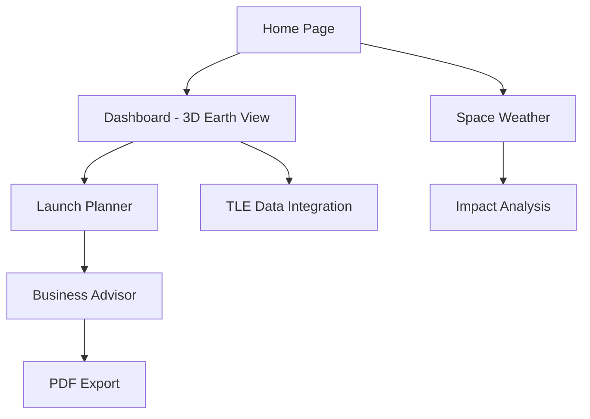

# 🛰️ Spacia

> **AI-Powered Space Traffic Control & LEO Mission Planning Platform**

Spacia is a comprehensive Next.js 15 SaaS platform that safeguards Low Earth Orbit (LEO) operations through real-time satellite tracking, collision prediction, space weather monitoring, and AI-driven mission planning. Built with modern web technologies and powered by local AI models, Spacia provides space operators with the tools they need for safe and sustainable orbital operations.

---

## 📋 Table of Contents

- [Key Features](#-key-features)
- [Platform Flow](#-platform-flow)
- [Tech Stack](#-tech-stack)
- [Project Structure](#-project-structure)
- [Getting Started](#-getting-started)
- [Core Modules](#-core-modules)
- [API Reference](#-api-reference)
- [Security & Privacy](#-security--privacy)
- [Troubleshooting](#-troubleshooting)
- [Roadmap](#-roadmap)
- [License](#-license)

---

## ✨ Key Features

### 🌍 Real-Time 3D Visualization
- **Interactive Earth Globe**: 3D visualization powered by Three.js showing Earth, satellites, and debris
- **LEO Object Tracking**: Real-time tracking of 13,000+ satellites and 28,000+ debris objects
- **Risk Zone Visualization**: Visual representation of high-density orbital zones
- **Interactive Controls**: Rotate, zoom, and explore orbital dynamics

### 🛰️ Space Weather Monitoring
- **Solar Activity Tracking**: Real-time solar flare monitoring (X, M, C-class events)
- **Geomagnetic Storm Alerts**: Kp Index tracking with 24-72 hour forecasts
- **Solar Wind Analysis**: Speed, density, temperature, and magnetic field monitoring
- **Coronal Mass Ejection (CME) Detection**: CME tracking with Earth-impact predictions
- **Aurora Forecasts**: Northern/Southern lights visibility predictions
- **Impact Assessment**: Detailed impact analysis for satellites, aviation, power grids, and communications
- **Proton Event Monitoring**: Solar radiation storm tracking for astronaut safety

### 🚀 Launch Planning & Orbit Analysis
- **Launch Site Feasibility**: Analysis of launch sites based on latitude and desired inclination
- **Debris Risk Assessment**: Orbit-specific collision risk scoring
- **Lifetime Estimation**: Orbital decay predictions with solar cycle considerations
- **25-Year Rule Compliance**: Automatic compliance checking for satellite deorbiting
- **Azimuth Range Calculations**: Optimal launch window recommendations
- **Alternative Site Suggestions**: Smart recommendations for optimal launch locations

### 🤖 AI-Powered Business Advisor
- **Mission Feasibility Analysis**: AI-driven assessment of commercial viability
- **Partner Ecosystem Matching**: Connect with relevant space industry partners
- **Proposal Generation**: Automated business proposal creation using Llama3
- **PDF Export**: Professional proposal documents for stakeholders
- **Market Intelligence**: Insights on LEO commercialization opportunities

### 📡 Earth Observation Integration
- **NASA GIBS Imagery**: Direct access to NASA's Global Imagery Browse Services
- **MODIS/VIIRS Data**: Multi-spectral Earth observation layers
- **WMTS/WMS Support**: Industry-standard geospatial protocols
- **Time-Series Analysis**: Historical imagery comparison capabilities

### 🔐 Enterprise Features
- **GitHub OAuth Authentication**: Secure user authentication via NextAuth
- **Session Management**: Protected routes and user-specific data
- **API Rate Limiting**: Built-in protection for external API calls
- **Data Caching**: 15-minute cache TTL for optimal performance
- **Privacy-First AI**: Local Ollama inference - no data leaves your infrastructure

---

## 🔄 Platform Flow



**User Journey:**
1. **Home**: Overview with live debris preview
2. **Dashboard**: Interactive 3D visualization of LEO environment
3. **Space Weather**: Real-time solar activity and geomagnetic conditions
4. **Planner**: Launch site analysis and orbital lifetime estimation
5. **Business**: AI-powered mission feasibility and proposal generation
6. **About**: Platform mission and technology overview

---

## 🧱 Tech Stack

### Frontend
- **Framework**: [Next.js 15](https://nextjs.org/) with App Router
- **React**: Version 19.1.0 with Server Components
- **TypeScript**: Version 5 for type safety
- **Styling**: [Tailwind CSS 4](https://tailwindcss.com/) with custom space theme
- **Animations**: [Framer Motion](https://www.framer.com/motion/) for smooth transitions
- **Charts**: [Recharts](https://recharts.org/) for space weather data visualization

### 3D Visualization
- **Three.js**: 3D graphics rendering for Earth and orbital objects
- **CesiumJS**: Advanced geospatial 3D globe visualization
- **Satellite.js**: TLE orbit propagation and calculations

### AI & Machine Learning
- **Ollama**: Local LLM inference server
- **Llama3**: Default model for business proposal generation
- **Private Inference**: All AI processing happens on your infrastructure

### Backend & APIs
- **Next.js API Routes**: Serverless API endpoints
- **NextAuth**: GitHub OAuth authentication
- **NASA APIs**: 
  - DONKI (Space Weather Database)
  - GIBS (Global Imagery Browse Services)
  - CME Analysis API
- **NOAA APIs**:
  - Space Weather Prediction Center
  - Planetary K-index
  - Solar Wind Data
  - Proton Events
- **CelesTrak**: TLE (Two-Line Element) data for satellite tracking

### Data & External Services
- **TLE Data Sources**: Real-time orbital element sets
- **Space Weather Data**: NOAA SWPC, NASA DONKI
- **Earth Observation**: NASA GIBS WMTS/WMS

### Development Tools
- **ESLint**: Code quality and consistency
- **PostCSS**: CSS processing and optimization
- **Turbopack**: Fast bundling for development and production

---

## 📂 Project Structure

```text
nasa-space-project-Spacia/
├── README.md                           # This file
├── package.json                        # Dependencies and scripts
├── next.config.ts                      # Next.js configuration
├── tsconfig.json                       # TypeScript configuration
├── tailwind.config.js                  # Tailwind CSS configuration
├── eslint.config.mjs                   # ESLint configuration
│
├── public/                             # Static assets
│   ├── minidasboard.png                # Dashboard preview image
│   ├── *.svg                           # Icon assets
│   └── cesium/                         # CesiumJS static assets
│       ├── Cesium.js                   # Cesium library
│       ├── Assets/                     # Terrain, imagery assets
│       ├── Widgets/                    # Cesium UI widgets
│       └── Workers/                    # Web workers for Cesium
│
└── src/
    ├── app/                            # Next.js App Router
    │   ├── layout.tsx                  # Root layout with auth provider
    │   ├── page.tsx                    # Home page with hero & preview
    │   ├── globals.css                 # Global styles & custom properties
    │   │
    │   ├── dashboard/
    │   │   └── page.tsx                # 3D Earth visualization
    │   │
    │   ├── spaceweather/
    │   │   └── page.tsx                # Space weather dashboard
    │   │
    │   ├── planner/
    │   │   └── page.tsx                # Launch planner interface
    │   │
    │   ├── business/
    │   │   └── page.tsx                # AI business advisor
    │   │
    │   ├── about/
    │   │   └── page.tsx                # About Spacia
    │   │
    │   └── api/                        # API Routes
    │       ├── auth/
    │       │   └── [...nextauth]/
    │       │       └── route.ts        # NextAuth configuration
    │       ├── weather/
    │       │   └── route.ts            # Space weather aggregation
    │       ├── business/
    │       │   └── route.ts            # Ollama LLM integration
    │       ├── planner/
    │       │   └── route.ts            # Orbit & launch analysis
    │       ├── alerts/
    │       │   └── route.ts            # Conjunction detection
    │       ├── tle/
    │       │   └── route.ts            # TLE data fetching
    │       └── gibs/
    │           └── route.ts            # NASA GIBS proxy
    │
    └── components/                     # React components
        ├── NavBar.tsx                  # Navigation bar with auth
        ├── Footer.tsx                  # Site footer
        ├── AuthProvider.tsx            # NextAuth session provider
        ├── RouteLoader.tsx             # Loading states
        ├── AnimatedHero.tsx            # Hero section with animations
        ├── MiniDashboard.tsx           # Live preview widget
        ├── PillarsSection.tsx          # Feature highlights
        ├── CTASection.tsx              # Call-to-action
        ├── WorldviewShowcase.tsx       # Platform showcase
        ├── EarthView.tsx               # Main 3D Earth component
        ├── EarthViwlanlog.tsx          # Alternative Earth view
        ├── LaunchPlanner.tsx           # Launch planning interface
        ├── StatsCards.tsx              # Statistics display
        ├── AlertsFeed.tsx              # Conjunction alerts
        ├── OrbitalGlobe.tsx            # Orbital visualization
        └── CesiumViewer.tsx            # Cesium integration
```

---

## 🚀 Getting Started

### Prerequisites

- **Node.js**: v18 or higher
- **npm**: v9 or higher
- **Ollama** (optional for AI features): [Install Ollama](https://ollama.ai/)
- **NASA API Key** (optional): [Get API Key](https://api.nasa.gov/)

### Installation

1. **Clone the repository**

```bash
git clone https://github.com/Rahulgupta7777/nasa-space-project-Spacia.git
cd nasa-space-project-Spacia
```

2. **Install dependencies**

```bash
npm install
```

3. **Configure environment variables**

Create a `.env.local` file in the root directory:

```env
# Ollama Configuration (for AI Business Advisor)
OLLAMA_URL=http://localhost:11434
OLLAMA_MODEL=llama3

# NextAuth Configuration
NEXTAUTH_SECRET=your-secret-key-here-generate-with-openssl-rand-base64-32
NEXTAUTH_URL=http://localhost:3000

# GitHub OAuth (optional - required for Business page)
GITHUB_ID=your-github-oauth-client-id
GITHUB_SECRET=your-github-oauth-client-secret

# NASA API (optional - uses DEMO_KEY by default)
NASA_API_KEY=your-nasa-api-key
```

4. **Set up Ollama (Optional - for AI features)**

```bash
# Install Ollama (macOS)
brew install ollama

# Start Ollama server
ollama serve

# Pull Llama3 model
ollama pull llama3
```

5. **Run development server**

```bash
npm run dev
```

Open [http://localhost:3000](http://localhost:3000) in your browser.

### Production Build

```bash
# Build for production
npm run build

# Start production server
npm start
```

---

## 🎯 Core Modules

### 1. Dashboard - 3D Earth Visualization

**File**: `src/app/dashboard/page.tsx`, `src/components/EarthView.tsx`

**Features**:
- Real-time 3D Earth globe with orbital objects
- Tracks 13,000+ satellites and 28,000+ debris objects
- Visual risk zones showing high-density areas
- Interactive object selection and information display
- Filters for satellites, large debris, and small debris
- Orbital path visualization
- Conjunction detection with proximity alerts

**Technology**: Three.js, WebGL, custom orbital mechanics

**Data Sources**: NASA aggregated statistics, simulated orbital data

### 2. Space Weather Dashboard

**File**: `src/app/spaceweather/page.tsx`, `src/app/api/weather/route.ts`

**Features**:
- **Solar Flares**: X/M/C-class event tracking with NOAA data
- **Geomagnetic Activity**: Kp index monitoring with 24-hour forecasts
- **Solar Wind**: Real-time speed, density, temperature, Bz/Bt magnetic field
- **CME Tracking**: Coronal mass ejection detection with Earth-impact ETAs
- **Proton Events**: Solar radiation storm monitoring
- **Aurora Forecasts**: Visibility predictions for high/mid latitudes
- **Impact Analysis**: Effects on satellites, aviation, power grids, GPS, communications
- **Weather Indices**: Dst, radiation belt levels, ionospheric disturbance

**Data Sources**:
- NASA DONKI API (Solar flares, CMEs)
- NOAA Space Weather Prediction Center
- Real-time magnetometer data
- Planetary K-index feeds

**Refresh**: Auto-updates every 5 minutes

### 3. Launch Planner

**File**: `src/app/planner/page.tsx`, `src/components/LaunchPlanner.tsx`, `src/app/api/planner/route.ts`

**Features**:
- **Site Feasibility Analysis**: Validates if a launch site can reach desired inclination
- **Debris Risk Scoring**: Low/Moderate/High risk assessment based on altitude
- **Orbital Lifetime Estimation**: Predicts satellite lifetime considering:
  - Atmospheric drag (altitude, area-to-mass ratio)
  - Solar cycle (min/max conditions)
  - Ballistic coefficient
- **25-Year Rule Compliance**: Automatic checking for deorbit requirements
- **Azimuth Calculations**: Optimal launch trajectory angles
- **Alternative Sites**: Smart suggestions (KSC, Vandenberg, Kourou, etc.)
- **Visual Orbit Preview**: 3D visualization of planned orbit

**Calculations**:
- King-Hele orbital decay model
- Altitude-dependent scale height
- Solar flux variations (F10.7 index)

### 4. AI Business Advisor

**File**: `src/app/business/page.tsx`, `src/app/api/business/route.ts`

**Features**:
- **Mission Feasibility Analysis**: AI-powered viability assessment
- **Project Type Support**: 
  - Communication Constellations
  - Earth Observation
  - Navigation/PNT
  - Space Manufacturing
  - Debris Removal
  - In-Orbit Servicing
  - Space Tourism
  - R&D Missions
- **Partner Ecosystem**: Integration suggestions across:
  - PNT/Navigation (Xona, Aerodome, VyomIC)
  - Earth Observation (Planet, Pixxel, Satellogic, Umbra)
  - Ground Stations (KSAT, AWS, Azure)
  - Communications (Mynaric, Viasat, Iridium)
  - Launch Services (SpaceX, Rocket Lab)
  - Analytics (SkyServe, Orbital Insight)
- **Proposal Generation**: Complete business proposals with:
  - Executive summary
  - Market analysis
  - Technical approach
  - Risk assessment
  - Timeline & budget breakdown
  - Partner recommendations
- **PDF Export**: Professional documents via jsPDF
- **Authentication Required**: Protected by NextAuth

**Technology**: Ollama + Llama3, runs 100% locally

### 5. Earth Observation

**File**: `src/app/api/gibs/route.ts`

**Features**:
- NASA GIBS WMTS/WMS proxy
- MODIS/VIIRS imagery layers
- Time-series support
- Tile-based streaming

---

## 📡 API Reference

### Authentication

Most API endpoints are public. The `/api/business` endpoint requires authentication via NextAuth.

### Space Weather API

**Endpoint**: `GET /api/weather`

**Response**:
```json
{
  "solarFlare": {
    "latestFlare": {
      "class": "M2.5",
      "activeRegion": "AR3599",
      "location": "N15W45",
      "peakTime": "2025-11-22T14:32:00Z",
      "instruments": ["GOES-16", "GOES-18"]
    },
    "statistics": {
      "last24h": 12,
      "last72h": 38,
      "byClass": { "X": 1, "M": 8, "C": 29 }
    }
  },
  "coronalMassEjection": {
    "latest": {
      "speed": 850,
      "startTime": "2025-11-21T18:00:00Z",
      "type": "S"
    },
    "estimatedArrival": "2025-11-24T06:00:00Z"
  },
  "kpIndex": {
    "current": 4.33,
    "max24h": 6.67,
    "stormLevel": "Minor Storm (G1)",
    "forecastNext24h": [4.0, 4.5, 5.0, ...]
  },
  "solarWind": {
    "speed_km_s": 520,
    "density_p_cm3": 8.2,
    "temperature_k": 95000,
    "bz_nT": -3.5,
    "bt_nT": 8.2,
    "pressure_nPa": 2.8
  },
  "impacts": { ... },
  "aurora": { ... }
}
```

**Caching**: 15 minutes

### Launch Planner API

**Endpoint**: `POST /api/planner`

**Request Body**:
```json
{
  "siteLat": 28.573255,
  "siteLon": -80.646895,
  "altitudeKm": 500,
  "inclinationDeg": 53,
  "massKg": 200,
  "areaM2": 0.5
}
```

**Response**:
```json
{
  "launchSiteAnalysis": {
    "userSite": "Custom Site",
    "feasible": true,
    "minInclinationRequired": 28.57,
    "azimuthRange": [45.2, 134.8],
    "bestAlternative": {
      "name": "Kennedy Space Center",
      "lat": 28.573255,
      "lon": -80.646895,
      "minIncl": 28.5,
      "feasible": true
    }
  },
  "debrisRisk": {
    "score": 6.5,
    "level": "moderate",
    "catalogDensityProxy": 0.65,
    "estimatedConjunctionsPerYear": 120,
    "notes": ["Moderate debris density at 500 km"]
  },
  "lifetimeYears": {
    "median": 8.5,
    "solarMin": 12.3,
    "solarMax": 4.2,
    "complies25yrRule": true
  },
  "recommendations": [
    "Consider active debris removal plan",
    "Implement collision avoidance maneuvers",
    "Install deorbit mechanism"
  ]
}
```

### Business Advisor API

**Endpoint**: `POST /api/business`

**Authentication**: Required (NextAuth session)

**Request Body**:
```json
{
  "projectName": "IndiaComm Constellation",
  "projectType": "Communication Constellation",
  "description": "Regional communication network for South Asia",
  "budget": "$50M - $100M",
  "timeline": "24-36 months",
  "partners": ["Ground Stations", "Launch Services"],
  "model": "llama3"
}
```

**Response**:
```json
{
  "result": "# LEO Commercialization Business Proposal\n\n## Executive Summary\n..."
}
```

### Alerts API

**Endpoint**: `GET /api/alerts`

**Response**:
```json
{
  "count": 3,
  "alerts": [
    {
      "a": "STARLINK-1234",
      "b": "DEBRIS-5678",
      "distance_km": 0.85,
      "time": "2025-11-22T15:30:00Z"
    }
  ]
}
```

### TLE Data API

**Endpoint**: `GET /api/tle`

**Response**: TLE data from CelesTrak

### GIBS Proxy API

**Endpoint**: `GET /api/gibs`

**Query Parameters**:
- `layer` (required): GIBS layer name
- `time`: ISO date string
- `wms`: Flag for WMS mode
- `width`, `height`, `bbox`: WMS parameters
- `tileMatrixSet`, `tileMatrix`, `tileRow`, `tileCol`: WMTS parameters

**Response**: `image/jpeg` or `image/png`

---

## 🔐 Security & Privacy

### Authentication
- **GitHub OAuth**: Secure authentication via NextAuth
- **Session Management**: HTTP-only cookies, secure tokens
- **Protected Routes**: Business advisor requires authentication

### AI Privacy
- **Local Inference**: Ollama runs on your infrastructure
- **No Data Leakage**: Mission data never leaves your network
- **Model Isolation**: Each session is independent

### API Security
- **Rate Limiting**: Built-in throttling for external APIs
- **Input Validation**: All user inputs sanitized
- **CORS Configuration**: Restricted cross-origin requests
- **Environment Variables**: Secrets stored in `.env.local` (never committed)

### Data Handling
- **Caching**: 15-minute TTL reduces API load
- **No Persistence**: Mission data not stored server-side
- **Client-Side Processing**: Heavy computation in browser when possible

---

## 🔧 Troubleshooting

### Ollama Connection Issues

**Problem**: "Failed to connect to Ollama server"

**Solutions**:
1. Ensure Ollama is running: `ollama serve`
2. Verify `OLLAMA_URL` in `.env.local` matches server address
3. Check Ollama is accessible: `curl http://localhost:11434/api/tags`
4. Pull the model: `ollama pull llama3`
5. Restart Next.js dev server after Ollama changes

### CesiumJS Loading Errors

**Problem**: "Failed to load Cesium assets"

**Solutions**:
1. Verify `public/cesium/` directory exists and is complete
2. Check browser console for specific asset errors
3. Clear browser cache and reload
4. Ensure static file serving is configured in `next.config.ts`

### NASA API Rate Limits

**Problem**: "NASA API rate limit exceeded"

**Solutions**:
1. Get a free API key from [api.nasa.gov](https://api.nasa.gov/)
2. Add `NASA_API_KEY` to `.env.local`
3. Default `DEMO_KEY` has 30 requests/hour limit
4. Personal keys have 1000 requests/hour

### Three.js Performance Issues

**Problem**: Low FPS in Dashboard view

**Solutions**:
1. Reduce number of visible objects using filters
2. Disable small debris visualization
3. Lower screen resolution or use smaller window
4. Update graphics drivers
5. Close other GPU-intensive applications

### Build Errors

**Problem**: TypeScript or ESLint errors during build

**Solutions**:
1. Run `npm install` to ensure all dependencies are installed
2. Check `tsconfig.json` and `eslint.config.mjs` configurations
3. Build ignores are enabled by default in `next.config.ts`
4. Use `npm run build -- --no-lint` to skip linting

### Authentication Issues

**Problem**: GitHub OAuth not working

**Solutions**:
1. Verify `GITHUB_ID` and `GITHUB_SECRET` in `.env.local`
2. Check OAuth app settings in GitHub Developer Settings
3. Ensure `NEXTAUTH_URL` matches your deployment URL
4. Add authorized callback URL: `http://localhost:3000/api/auth/callback/github`
5. Regenerate `NEXTAUTH_SECRET`: `openssl rand -base64 32`

---

## 🗺️ Roadmap

### Q1 2026
- [ ] **Historical Playback**: Rewind/replay orbital events
- [ ] **Custom Notifications**: Email/SMS alerts for conjunctions
- [ ] **Multi-Language Support**: i18n implementation
- [ ] **Mobile App**: React Native companion app

### Q2 2026
- [ ] **Advanced Collision Prediction**: ML-based trajectory forecasting
- [ ] **Maneuver Planning**: Delta-V calculation and optimization
- [ ] **Integration APIs**: Webhooks for external systems
- [ ] **Team Collaboration**: Multi-user workspaces

### Q3 2026
- [ ] **Satellite Operator Portal**: Direct submissions from operators
- [ ] **Regulatory Compliance**: Automated FCC/ITU filing assistance
- [ ] **Insurance Integration**: Risk metrics for space insurance
- [ ] **Marketplace**: Connect operators with service providers

### Future
- [ ] **Quantum-Safe Encryption**: Post-quantum cryptography
- [ ] **Edge Computing**: Distributed processing nodes
- [ ] **AR/VR Visualization**: Immersive orbital environment
- [ ] **Autonomous Collision Avoidance**: AI-driven maneuver execution

---

## 📄 License

This project is licensed under the **MIT License**.

```
MIT License

Copyright (c) 2025 Spacia Project

Permission is hereby granted, free of charge, to any person obtaining a copy
of this software and associated documentation files (the "Software"), to deal
in the Software without restriction, including without limitation the rights
to use, copy, modify, merge, publish, distribute, sublicense, and/or sell
copies of the Software, and to permit persons to whom the Software is
furnished to do so, subject to the following conditions:

The above copyright notice and this permission notice shall be included in all
copies or substantial portions of the Software.

THE SOFTWARE IS PROVIDED "AS IS", WITHOUT WARRANTY OF ANY KIND, EXPRESS OR
IMPLIED, INCLUDING BUT NOT LIMITED TO THE WARRANTIES OF MERCHANTABILITY,
FITNESS FOR A PARTICULAR PURPOSE AND NONINFRINGEMENT. IN NO EVENT SHALL THE
AUTHORS OR COPYRIGHT HOLDERS BE LIABLE FOR ANY CLAIM, DAMAGES OR OTHER
LIABILITY, WHETHER IN AN ACTION OF CONTRACT, TORT OR OTHERWISE, ARISING FROM,
OUT OF OR IN CONNECTION WITH THE SOFTWARE OR THE USE OR OTHER DEALINGS IN THE
SOFTWARE.
```

---

## 🤝 Contributing

Contributions are welcome! Please follow these guidelines:

1. **Fork the repository**
2. **Create a feature branch**: `git checkout -b feature/amazing-feature`
3. **Commit changes**: `git commit -m 'Add amazing feature'`
4. **Push to branch**: `git push origin feature/amazing-feature`
5. **Open a Pull Request**

### Development Guidelines
- Follow TypeScript best practices
- Maintain test coverage above 80%
- Document all API endpoints
- Use conventional commit messages
- Ensure accessibility (WCAG 2.1 AA)

---

## 🙏 Acknowledgments

- **NASA**: DONKI API, GIBS imagery
- **NOAA**: Space Weather Prediction Center data
- **CelesTrak**: TLE orbital element sets
- **CesiumJS**: 3D geospatial platform
- **Ollama**: Local LLM inference
- **Next.js Team**: Amazing React framework
- **Space Community**: Feedback and support

---

## 📞 Contact & Support

- **GitHub**: [Rahulgupta7777/nasa-space-project-Spacia](https://github.com/Rahulgupta7777/nasa-space-project-Spacia)
- **Issues**: [GitHub Issues](https://github.com/Rahulgupta7777/nasa-space-project-Spacia/issues)
- **Discussions**: [GitHub Discussions](https://github.com/Rahulgupta7777/nasa-space-project-Spacia/discussions)

---

<div align="center">

**Developed with ⚡ by the Spacia Team**

*Safeguarding the Future of Space Operations*

[🌐 Visit Website](https://spacia.space) • [📚 Documentation](https://docs.spacia.space) • [🚀 Get Started](#-getting-started)

</div>
