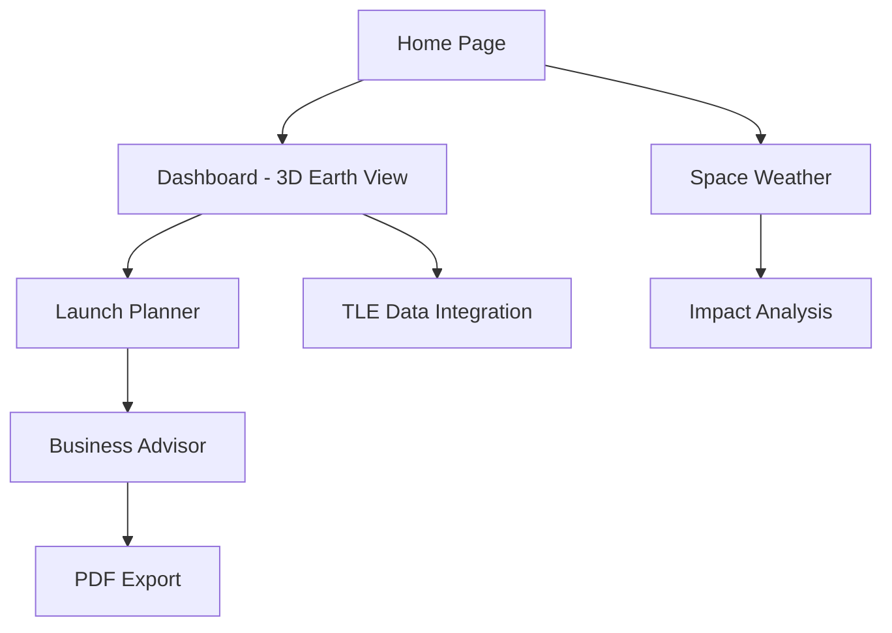

# Spacia - LEO Business & Operations Platform

## Problem Statement

As the commercialization of space rapidly accelerates, the future of business in low Earth orbit (LEO) holds incredible potential, but also presents significant operational, regulatory, and environmental challenges. This new economic frontier invites innovative and sustainable approaches to foster long-term viability and responsible execution. Your challenge is to conceptualize and design a scalable, sustainable, business model, accompanied by a prototype, that explores the unique opportunities LEO offers while addressing the complexities of operating in space. (Joint Agency Satellite Division)

## Project Video

[Watch the Video](https://drive.google.com/file/d/1Wkv_pZ3fWeAM2SeOe6yKeXC_lzZI-MBa/view?usp=sharing)
<video controls src="./submission/spacia%20demo.mov" width="100%" title="Application Demo"></video>
---

## 📋 Table of Contents

- [Page Highlights](#-page-highlights)
- [Platform Flow](#-platform-flow)
- [Tech Stack](#-tech-stack)
- [Project Structure](#-project-structure)
- [Getting Started](#-getting-started)
- [Core Modules](#-core-modules)
- [API Reference](#-api-reference)
- [Security & Privacy](#-security--privacy)
- [Troubleshooting](#-troubleshooting)
- [License](#-license)

---

## ✨ Page Highlights

### 🏠 Home Page

**Location**: `src/app/page.tsx`
The landing page introduces the Spacia platform with a high-impact visual experience.

- **Hero Section**: Features an `AnimatedHero` component that engages users immediately.
- **Live Preview**: Includes a `MiniDashboard` to give a glimpse of the real-time tracking capabilities.
- **Features Overview**: Showcases key platform pillars using `PillarsSection` and `WorldviewShowcase`.

### 🌍 Dashboard (3D Earth View)

**Location**: `src/app/dashboard/page.tsx`
The core of the platform, offering a comprehensive view of the orbital environment.

- **Interactive Globe**: Powered by the `EarthView` component, rendering a 3D Earth with real-time satellite and debris data.
- **Real-Time Tracking**: Visualizes over 13,000 satellites and 28,000 debris objects.
- **Risk Zones**: Highlights high-density areas and potential collision risks.
- **Controls**: Users can filter objects, view orbits, and inspect specific satellites.

### ☀️ Space Weather

**Location**: `src/app/spaceweather/page.tsx`
A dedicated dashboard for monitoring solar and geomagnetic conditions that impact space operations.

- **Solar Activity**: Tracks solar flares and solar wind data.
- **Impact Analysis**: Assesses risks to satellites, communications, and power grids.
- **Visualizations**: Uses charts and data feeds to present complex weather data clearly.

### 🚀 Launch Planner

**Location**: `src/app/planner/page.tsx`
A critical tool for mission planning and orbit analysis.

- **Feasibility Checks**: Validates launch sites against desired orbital inclinations.
- **Debris Risk Assessment**: Calculates collision risks for specific altitudes using the `LaunchPlanner` component.
- **Lifetime Estimation**: Predicts orbital decay and ensures compliance with the 25-year deorbit rule.
- **3D Preview**: Visualizes the planned orbit using `OrbitalGlobe`.

### 💼 Business Advisor

**Location**: `src/app/business/page.tsx`
An AI-powered module designed to assist with the commercial aspects of space missions.

- **AI Integration**: Utilizes **any llm model** to generate insights and proposals.
- **Mission Feasibility**: Analyzes the viability of proposed space business models.
- **Proposal Generation**: Automatically creates detailed business proposals, which can be exported to PDF.
- **Partner Ecosystem**: Suggests relevant industry partners for launch, ground stations, and insurance.

---

## 🔄 Platform Flow


```mermaid
flowchart TB
    A[Home Page] --> B[Dashboard - 3D Earth View]
    A --> C[Space Weather]
    B --> D[Launch Planner]
    D --> E[Business Advisor]
    E --> F[PDF Export]
    C --> G[Impact Analysis]
    B --> H[TLE Data Integration]
```

**User Journey:**

1. **Home**: Overview with live debris preview
2. **Dashboard**: Interactive 3D visualization of LEO environment
3. **Space Weather**: Real-time solar activity and geomagnetic conditions
4. **Planner**: Launch site analysis and orbital lifetime estimation
5. **Business**: AI-powered mission feasibility and proposal generation
6. **About**: Platform mission and technology overview

---

## 🧱 Tech Stack

### Frontend

- **Framework**: [Next.js 15](https://nextjs.org/) with App Router
- **React**: Version 19.1.0 with Server Components
- **TypeScript**: Version 5 for type safety
- **Styling**: [Tailwind CSS 4](https://tailwindcss.com/) with custom space theme
- **Animations**: [Framer Motion](https://www.framer.com/motion/) for smooth transitions
- **Charts**: [Recharts](https://recharts.org/) for space weather data visualization

### 3D Visualization

- **Three.js**: 3D graphics rendering for Earth and orbital objects
- **CesiumJS**: Advanced geospatial 3D globe visualization
- **Satellite.js**: TLE orbit propagation and calculations

### AI & Machine Learning

- **LLM Server**: Local or remote LLM inference server (e.g., any llm model)
- **Model**: Configurable model for business proposal generation
- **Private Inference**: All AI processing happens on your infrastructure

### Backend & APIs

- **Next.js API Routes**: Serverless API endpoints
- **NextAuth**: GitHub OAuth authentication
- **NASA APIs**:
  - DONKI (Space Weather Database)
  - GIBS (Global Imagery Browse Services)
  - CME Analysis API
- **NOAA APIs**:
  - Space Weather Prediction Center
  - Planetary K-index
  - Solar Wind Data
  - Proton Events
- **CelesTrak**: TLE (Two-Line Element) data for satellite tracking

### Data & External Services

- **TLE Data Sources**: Real-time orbital element sets
- **Space Weather Data**: NOAA SWPC, NASA DONKI
- **Earth Observation**: NASA GIBS WMTS/WMS

### Development Tools

- **ESLint**: Code quality and consistency
- **PostCSS**: CSS processing and optimization
- **Turbopack**: Fast bundling for development and production

---

## 📂 Project Structure

```text
nasa-space-project-Spacia/
├── README.md                           # This file
├── package.json                        # Dependencies and scripts
├── next.config.ts                      # Next.js configuration
├── tsconfig.json                       # TypeScript configuration
├── tailwind.config.js                  # Tailwind CSS configuration
├── eslint.config.mjs                   # ESLint configuration
│
├── public/                             # Static assets
│   ├── minidasboard.png                # Dashboard preview image
│   ├── *.svg                           # Icon assets
│   └── cesium/                         # CesiumJS static assets
│       ├── Cesium.js                   # Cesium library
│       ├── Assets/                     # Terrain, imagery assets
│       ├── Widgets/                    # Cesium UI widgets
│       └── Workers/                    # Web workers for Cesium
│
└── src/
    ├── app/                            # Next.js App Router
    │   ├── layout.tsx                  # Root layout with auth provider
    │   ├── page.tsx                    # Home page with hero & preview
    │   ├── globals.css                 # Global styles & custom properties
    │   │
    │   ├── dashboard/
    │   │   └── page.tsx                # 3D Earth visualization
    │   │
    │   ├── spaceweather/
    │   │   └── page.tsx                # Space weather dashboard
    │   │
    │   ├── planner/
    │   │   └── page.tsx                # Launch planner interface
    │   │
    │   ├── business/
    │   │   └── page.tsx                # AI business advisor
    │   │
    │   ├── about/
    │   │   └── page.tsx                # About Spacia
    │   │
    │   └── api/                        # API Routes
    │       ├── auth/
    │       │   └── [...nextauth]/
    │       │       └── route.ts        # NextAuth configuration
    │       ├── weather/
    │       │   └── route.ts            # Space weather aggregation
    │       ├── business/
    │       │   └── route.ts            # LLM integration
    │       ├── planner/
    │       │   └── route.ts            # Orbit & launch analysis
    │       ├── alerts/
    │       │   └── route.ts            # Conjunction detection
    │       ├── tle/
    │       │   └── route.ts            # TLE data fetching
    │       └── gibs/
    │           └── route.ts            # NASA GIBS proxy
    │
    └── components/                     # React components
        ├── NavBar.tsx                  # Navigation bar with auth
        ├── Footer.tsx                  # Site footer
        ├── AuthProvider.tsx            # NextAuth session provider
        ├── RouteLoader.tsx             # Loading states
        ├── AnimatedHero.tsx            # Hero section with animations
        ├── MiniDashboard.tsx           # Live preview widget
        ├── PillarsSection.tsx          # Feature highlights
        ├── CTASection.tsx              # Call-to-action
        ├── WorldviewShowcase.tsx       # Platform showcase
        ├── EarthView.tsx               # Main 3D Earth component
        ├── EarthViwlanlog.tsx          # Alternative Earth view
        ├── LaunchPlanner.tsx           # Launch planning interface
        ├── StatsCards.tsx              # Statistics display
        ├── AlertsFeed.tsx              # Conjunction alerts
        ├── OrbitalGlobe.tsx            # Orbital visualization
        └── CesiumViewer.tsx            # Cesium integration
```

---

## 🚀 Getting Started

### Prerequisites

- **Node.js**: v18 or higher
- **npm**: v9 or higher
- **LLM Provider** (optional for AI features): Any LLM model server
- **NASA API Key** (optional): [Get API Key](https://api.nasa.gov/)

### Installation

1. **Clone the repository**

```bash
git clone https://github.com/Rahulgupta7777/nasa-space-project-Spacia.git
cd nasa-space-project-Spacia
```

1. **Install dependencies**

```bash
npm install
```

1. **Configure environment variables**

Create a `.env.local` file in the root directory:

```env
# LLM Configuration (for AI Business Advisor)
LLM_URL=http://localhost:11434
LLM_MODEL=any-llm-model

# NextAuth Configuration
NEXTAUTH_SECRET=your-secret-key-here-generate-with-openssl-rand-base64-32
NEXTAUTH_URL=http://localhost:3000

# GitHub OAuth (optional - required for Business page)
GITHUB_ID=your-github-oauth-client-id
GITHUB_SECRET=your-github-oauth-client-secret

# NASA API (optional - uses DEMO_KEY by default)
NASA_API_KEY=your-nasa-api-key
```

1. **Set up LLM (Optional - for AI features)**

Ensure you have access to any LLM model server.

1. **Run development server**

```bash
npm run dev
```

Open [http://localhost:3000](http://localhost:3000) in your browser.

### Production Build

```bash
# Build for production
npm run build

# Start production server
npm start
```

---

## 🎯 Core Modules

### 1. Dashboard - 3D Earth Visualization

**File**: `src/app/dashboard/page.tsx`, `src/components/EarthView.tsx`

**Features**:

- Real-time 3D Earth globe with orbital objects
- Tracks 13,000+ satellites and 28,000+ debris objects
- Visual risk zones showing high-density areas
- Interactive object selection and information display
- Filters for satellites, large debris, and small debris
- Orbital path visualization
- Conjunction detection with proximity alerts

**Technology**: Three.js, WebGL, custom orbital mechanics

**Data Sources**: NASA aggregated statistics, simulated orbital data

### 2. Space Weather Dashboard

**File**: `src/app/spaceweather/page.tsx`, `src/app/api/weather/route.ts`

**Features**:

- **Solar Flares**: X/M/C-class event tracking with NOAA data
- **Geomagnetic Activity**: Kp index monitoring with 24-hour forecasts
- **Solar Wind**: Real-time speed, density, temperature, Bz/Bt magnetic field
- **CME Tracking**: Coronal mass ejection detection with Earth-impact ETAs
- **Proton Events**: Solar radiation storm monitoring
- **Aurora Forecasts**: Visibility predictions for high/mid latitudes
- **Impact Analysis**: Effects on satellites, aviation, power grids, GPS, communications
- **Weather Indices**: Dst, radiation belt levels, ionospheric disturbance

**Data Sources**:

- NASA DONKI API (Solar flares, CMEs)
- NOAA Space Weather Prediction Center
- Real-time magnetometer data
- Planetary K-index feeds

**Refresh**: Auto-updates every 5 minutes

### 3. Launch Planner

**File**: `src/app/planner/page.tsx`, `src/components/LaunchPlanner.tsx`, `src/app/api/planner/route.ts`

**Features**:

- **Site Feasibility Analysis**: Validates if a launch site can reach desired inclination
- **Debris Risk Scoring**: Low/Moderate/High risk assessment based on altitude
- **Orbital Lifetime Estimation**: Predicts satellite lifetime considering:
  - Atmospheric drag (altitude, area-to-mass ratio)
  - Solar cycle (min/max conditions)
  - Ballistic coefficient
- **25-Year Rule Compliance**: Automatic checking for deorbit requirements
- **Azimuth Calculations**: Optimal launch trajectory angles
- **Alternative Sites**: Smart suggestions (KSC, Vandenberg, Kourou, etc.)
- **Visual Orbit Preview**: 3D visualization of planned orbit

**Calculations**:

- King-Hele orbital decay model
- Altitude-dependent scale height
- Solar flux variations (F10.7 index)

### 4. AI Business Advisor

**File**: `src/app/business/page.tsx`, `src/app/api/business/route.ts`

**Features**:

- **Mission Feasibility Analysis**: AI-powered viability assessment
- **Project Type Support**:
  - Communication Constellations
  - Earth Observation
  - Navigation/PNT
  - Space Manufacturing
  - Debris Removal
  - In-Orbit Servicing
  - Space Tourism
  - R&D Missions
- **Partner Ecosystem**: Integration suggestions across:
  - PNT/Navigation (Xona, Aerodome, VyomIC)
  - Earth Observation (Planet, Pixxel, Satellogic, Umbra)
  - Ground Stations (KSAT, AWS, Azure)
  - Communications (Mynaric, Viasat, Iridium)
  - Launch Services (SpaceX, Rocket Lab)
  - Analytics (SkyServe, Orbital Insight)
- **Proposal Generation**: Complete business proposals with:
  - Executive summary
  - Market analysis
  - Technical approach
  - Risk assessment
  - Timeline & budget breakdown
  - Partner recommendations
- **PDF Export**: Professional documents via jsPDF
- **Authentication Required**: Protected by NextAuth

**Technology**: Any LLM model, runs 100% locally or remotely

### 5. Earth Observation

**File**: `src/app/api/gibs/route.ts`

**Features**:

- NASA GIBS WMTS/WMS proxy
- MODIS/VIIRS imagery layers
- Time-series support
- Tile-based streaming

---

## 📡 API Reference

### Authentication

Most API endpoints are public. The `/api/business` endpoint requires authentication via NextAuth.

### Space Weather API

**Endpoint**: `GET /api/weather`

**Response**:

```json
{
  "solarFlare": {
    "latestFlare": {
      "class": "M2.5",
      "activeRegion": "AR3599",
      "location": "N15W45",
      "peakTime": "2025-11-22T14:32:00Z",
      "instruments": ["GOES-16", "GOES-18"]
    },
    "statistics": {
      "last24h": 12,
      "last72h": 38,
      "byClass": { "X": 1, "M": 8, "C": 29 }
    }
  },
  "coronalMassEjection": {
    "latest": {
      "speed": 850,
      "startTime": "2025-11-21T18:00:00Z",
      "type": "S"
    },
    "estimatedArrival": "2025-11-24T06:00:00Z"
  },
  "kpIndex": {
    "current": 4.33,
    "max24h": 6.67,
    "stormLevel": "Minor Storm (G1)",
    "forecastNext24h": [4.0, 4.5, 5.0, ...]
  },
  "solarWind": {
    "speed_km_s": 520,
    "density_p_cm3": 8.2,
    "temperature_k": 95000,
    "bz_nT": -3.5,
    "bt_nT": 8.2,
    "pressure_nPa": 2.8
  },
  "impacts": { ... },
  "aurora": { ... }
}
```

**Caching**: 15 minutes

### Launch Planner API

**Endpoint**: `POST /api/planner`

**Request Body**:

```json
{
  "siteLat": 28.573255,
  "siteLon": -80.646895,
  "altitudeKm": 500,
  "inclinationDeg": 53,
  "massKg": 200,
  "areaM2": 0.5
}
```

**Response**:

```json
{
  "launchSiteAnalysis": {
    "userSite": "Custom Site",
    "feasible": true,
    "minInclinationRequired": 28.57,
    "azimuthRange": [45.2, 134.8],
    "bestAlternative": {
      "name": "Kennedy Space Center",
      "lat": 28.573255,
      "lon": -80.646895,
      "minIncl": 28.5,
      "feasible": true
    }
  },
  "debrisRisk": {
    "score": 6.5,
    "level": "moderate",
    "catalogDensityProxy": 0.65,
    "estimatedConjunctionsPerYear": 120,
    "notes": ["Moderate debris density at 500 km"]
  },
  "lifetimeYears": {
    "median": 8.5,
    "solarMin": 12.3,
    "solarMax": 4.2,
    "complies25yrRule": true
  },
  "recommendations": [
    "Consider active debris removal plan",
    "Implement collision avoidance maneuvers",
    "Install deorbit mechanism"
  ]
}
```

### Business Advisor API

**Endpoint**: `POST /api/business`

**Authentication**: Required (NextAuth session)

**Request Body**:

```json
{
  "projectName": "IndiaComm Constellation",
  "projectType": "Communication Constellation",
  "description": "Regional communication network for South Asia",
  "budget": "$50M - $100M",
  "timeline": "24-36 months",
  "partners": ["Ground Stations", "Launch Services"],
  "model": "any-llm-model"
}
```

**Response**:

```json
{
  "result": "# LEO Commercialization Business Proposal\n\n## Executive Summary\n..."
}
```

### Alerts API

**Endpoint**: `GET /api/alerts`

**Response**:

```json
{
  "count": 3,
  "alerts": [
    {
      "a": "STARLINK-1234",
      "b": "DEBRIS-5678",
      "distance_km": 0.85,
      "time": "2025-11-22T15:30:00Z"
    }
  ]
}
```

### TLE Data API

**Endpoint**: `GET /api/tle`

**Response**: TLE data from CelesTrak

### GIBS Proxy API

**Endpoint**: `GET /api/gibs`

**Query Parameters**:

- `layer` (required): GIBS layer name
- `time`: ISO date string
- `wms`: Flag for WMS mode
- `width`, `height`, `bbox`: WMS parameters
- `tileMatrixSet`, `tileMatrix`, `tileRow`, `tileCol`: WMTS parameters

**Response**: `image/jpeg` or `image/png`

---

## 🔐 Security & Privacy

### Authentication

- **GitHub OAuth**: Secure authentication via NextAuth
- **Session Management**: HTTP-only cookies, secure tokens
- **Protected Routes**: Business advisor requires authentication

### AI Privacy

- **Local Inference**: LLM runs on your infrastructure
- **No Data Leakage**: Mission data never leaves your network
- **Model Isolation**: Each session is independent

### API Security

- **Rate Limiting**: Built-in throttling for external APIs
- **Input Validation**: All user inputs sanitized
- **CORS Configuration**: Restricted cross-origin requests
- **Environment Variables**: Secrets stored in `.env.local` (never committed)

### Data Handling

- **Caching**: 15-minute TTL reduces API load
- **No Persistence**: Mission data not stored server-side
- **Client-Side Processing**: Heavy computation in browser when possible

---

## 🔧 Troubleshooting

### LLM Connection Issues

**Problem**: "Failed to connect to LLM server"

**Solutions**:

1. Ensure LLM server is running
2. Verify `LLM_URL` in `.env.local` matches server address
3. Check LLM is accessible
4. Restart Next.js dev server after LLM changes

### CesiumJS Loading Errors

**Problem**: "Failed to load Cesium assets"

**Solutions**:

1. Verify `public/cesium/` directory exists and is complete
2. Check browser console for specific asset errors
3. Clear browser cache and reload
4. Ensure static file serving is configured in `next.config.ts`

### NASA API Rate Limits

**Problem**: "NASA API rate limit exceeded"

**Solutions**:

1. Get a free API key from [api.nasa.gov](https://api.nasa.gov/)
2. Add `NASA_API_KEY` to `.env.local`
3. Default `DEMO_KEY` has 30 requests/hour limit
4. Personal keys have 1000 requests/hour

### Three.js Performance Issues

**Problem**: Low FPS in Dashboard view

**Solutions**:

1. Reduce number of visible objects using filters
2. Disable small debris visualization
3. Lower screen resolution or use smaller window
4. Update graphics drivers
5. Close other GPU-intensive applications

### Build Errors

**Problem**: TypeScript or ESLint errors during build

**Solutions**:

1. Run `npm install` to ensure all dependencies are installed
2. Check `tsconfig.json` and `eslint.config.mjs` configurations
3. Build ignores are enabled by default in `next.config.ts`
4. Use `npm run build -- --no-lint` to skip linting

### Authentication Issues

**Problem**: GitHub OAuth not working

**Solutions**:

1. Verify `GITHUB_ID` and `GITHUB_SECRET` in `.env.local`
2. Check OAuth app settings in GitHub Developer Settings
3. Ensure `NEXTAUTH_URL` matches your deployment URL
4. Add authorized callback URL: `http://localhost:3000/api/auth/callback/github`
5. Regenerate `NEXTAUTH_SECRET`: `openssl rand -base64 32`

---

## 📄 License

This project is licensed under the **MIT License**.

```
MIT License

Copyright (c) 2025 Spacia Project

Permission is hereby granted, free of charge, to any person obtaining a copy
of this software and associated documentation files (the "Software"), to deal
in the Software without restriction, including without limitation the rights
to use, copy, modify, merge, publish, distribute, sublicense, and/or sell
copies of the Software, and to permit persons to whom the Software is
furnished to do so, subject to the following conditions:

The above copyright notice and this permission notice shall be included in all
copies or substantial portions of the Software.

THE SOFTWARE IS PROVIDED "AS IS", WITHOUT WARRANTY OF ANY KIND, EXPRESS OR
IMPLIED, INCLUDING BUT NOT LIMITED TO THE WARRANTIES OF MERCHANTABILITY,
FITNESS FOR A PARTICULAR PURPOSE AND NONINFRINGEMENT. IN NO EVENT SHALL THE
AUTHORS OR COPYRIGHT HOLDERS BE LIABLE FOR ANY CLAIM, DAMAGES OR OTHER
LIABILITY, WHETHER IN AN ACTION OF CONTRACT, TORT OR OTHERWISE, ARISING FROM,
OUT OF OR IN CONNECTION WITH THE SOFTWARE OR THE USE OR OTHER DEALINGS IN THE
SOFTWARE.
```

---

## 🤝 Contributing

Contributions are welcome! Please follow these guidelines:

1. **Fork the repository**
2. **Create a feature branch**: `git checkout -b feature/amazing-feature`
3. **Commit changes**: `git commit -m 'Add amazing feature'`
4. **Push to branch**: `git push origin feature/amazing-feature`
5. **Open a Pull Request**

### Development Guidelines

- Follow TypeScript best practices
- Maintain test coverage above 80%
- Document all API endpoints
- Use conventional commit messages
- Ensure accessibility (WCAG 2.1 AA)

---

## 🙏 Acknowledgments

- **NASA**: DONKI API, GIBS imagery
- **NOAA**: Space Weather Prediction Center data
- **CelesTrak**: TLE orbital element sets
- **CesiumJS**: 3D geospatial platform
- **LLM Provider**: Local LLM inference
- **Next.js Team**: Amazing React framework
- **Space Community**: Feedback and support

---

## 📞 Contact & Support

- **GitHub**: [Rahulgupta7777/nasa-space-project-Spacia](https://github.com/Rahulgupta7777/nasa-space-project-Spacia)
- **Issues**: [GitHub Issues](https://github.com/Rahulgupta7777/nasa-space-project-Spacia/issues)
- **Discussions**: [GitHub Discussions](https://github.com/Rahulgupta7777/nasa-space-project-Spacia/discussions)

---
